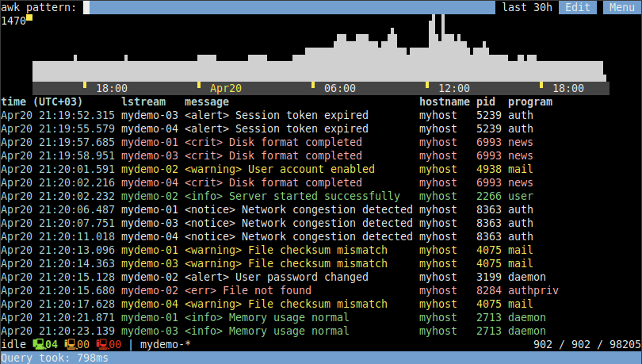
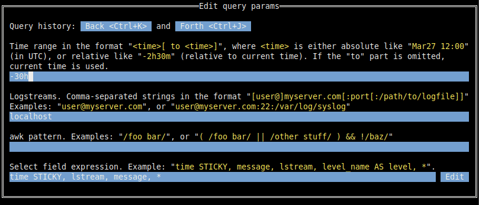

# Nerdlog

Nerdlog is a fast, remote-first, multi-host TUI log viewer with timeline
histogram and no central server. Loosely inspired by Graylog/Kibana, but
without the bloat. Pretty much no setup needed, either.

It's laser-focused on being efficient while querying logs from multiple remote
machines simultaneously, filtering them by time range and patterns, while also
drawing a timeline histogram for quick visual insight:



Primary use case: reading system logs (from the files `/var/log/messages` or
`/var/log/syslog`, or straight from `journalctl`) from one or more remote
hosts. Very efficient even on large log files (like 1GB or more).

It does support some other log formats and can use any log files, but that was the primary use case which was driving the implementation: we were having our web service backend running as systemd services on a bunch of Linux instances, printing a lot of logs, and wanted to be able to read these logs efficiently and having the timeline histogram, much like tools like Graylog have.

## Design highlights

- No centralized server required; nerdlog establishes an ssh connection to
  every node that the user wants to collect logs from, and keeps them idle in
  the background (although a separate server to store the log files might still
  help in some cases; see the [Requirements and limitations](https://dmitryfrank.com/projects/nerdlog/article#requirements) sections in the article);
- Logs are not downloaded to the local machine in full: all the log analysis
  is done on the remote nodes, and on each query, only the following data is
  downloaded from each node: up to 250 messages from every logstream
  (configurable), and data for the timeline histogram. It's obviously possible
  to paginate over the logs, to get the next bunch of messages, etc. Nerdlog
  then merges the responses from all nodes together, and presents to the user
  in a unified form;
- Most of the data is gzipped in transit, thus saving the bandwidth as well.

## Demo

Here’s a quick demo showing how Nerdlog works across four remote nodes:


## Project history

It might be useful to know the history to understand the project motivation and
overall direction, you can read it
[here in the full article](https://dmitryfrank.com/projects/nerdlog/article#project_history).

## Project state

Originally hacked together in 2022 to replace painfully slow Splunk setups.
Revisited in 2025 to clean it up to a certain extent, and open source it.

It's still kinda in a proof-of-concept stage though. Implemented as fast as
possible, spaghetti code abounds, could be covered with more tests, a lot more
features could be implemented, etc. Was only tested for real on Linux, and with
Linux hosts to get the logs from.

But it works. It's pretty usable and surprisingly fast.

## Installation

To build it, you need [Go](https://go.dev/). Having it installed, there are a
few options:

### Using `go install`

```
go install github.com/dimonomid/nerdlog/cmd/nerdlog@latest
```

Unless you have custom `GOPATH` or `GOBIN` env vars set, it will install the
`nerdlog` binary to `$HOME/go/bin`.

### Using `make`

To install `nerdlog` binary to your `/usr/local/bin`:

```
$ make && sudo make install
```

Or to build and run without installing:

```
$ make && bin/nerdlog
```

## Usage

When you open the app (`nerdlog` binary), it'll show a query edit form with a
few fields:



Time range is self-explanatory.

Next one is "Logstreams": shortly, as the name suggests, a logstream is a
contiguous stream of log messages, on a particular server accessible via ssh.
As of now, two kinds of logstreams are supported:

- One or more _consecutive_ log files like `/var/log/syslog` and
  `/var/log/syslog.1` (actually as of now there can be at most 2 files in a
  logstream, but this limitation will hopefully be removed).
- Logs returned from `journalctl`

By default, nerdlog checks available logstreams in the following order:

- If available, use the `/var/log/messages` file (and the older `/var/log/messages.1`)
- If available, use the `/var/log/syslog` file (and the older `/var/log/syslog.1`)
- As the last resort, use `journalctl` if available.

Why preferring the logfiles instead of `journalctl`: because [log files work
much faster and are more
reliable](https://github.com/dimonomid/nerdlog/issues/7#issuecomment-2820521885).
For some benchmarks, [also see this
comment](https://github.com/dimonomid/nerdlog/issues/7#issuecomment-2823303380).
However, `journalctl` is more universally available these days, and it often also
has longer history, so nerdlog has full support for it. So far there's no
option to prefer `journalctl` instead of log files by default, lmk if you need it;
shouldn't be hard to implement.

So if you have a server like `myserver.com` accessible via ssh on port 22, then
the logstream to read its `/var/log/messages` file (or `/var/log/syslog` file,
or from `journalctl` if none of these files are present) could be:

```
myuser@myserver.com
```

If you need a different port and/or different log files, then a more explicit
form is:

```
myuser@myserver.com:1234:/some/other/logfile
```

To select `journalctl` explicitly, specify `journalctl` as the log file:

```
myuser@myserver.com:1234:journalctl
```

Multiple logstreams can be provided separated by commas, like this:

```
myuser@myserver.com, myuser@myserver.com:1234:/some/other/logfile
```

Nerdlog also reads ssh config (`~/.ssh/config`) and can take the port, username
and hostname from there. It supports globs too, so e.g. in your ssh config you
have two hosts like `myhost-01` and `myhost-02`, then instead of specifying
your logstreams as `myhost-01,myhost-02` it can be simply `myhost-*`.

Obviously though, we can't specify the log files in the ssh config, so if you
need to configure a logstream for non-default log file on some host(s), you can
use the nerdlog's own logstreams config file `~/.config/nerdlog/logstreams.yaml`,
which can look like this:

```
log_streams:
  myhost-01:
    hostname: actualhost1.com
    port: 1234
    user: myuser
    log_files:
      - /some/custom/logfile
  myhost-02:
    hostname: actualhost2.com
    port: 7890
    user: myuser
    log_files:
      - /some/custom/logfile
```

The last thing on that query form is the "Select field expression", it looks
like this:

```
time STICKY, lstream, message, *
```

It only affects the presentation of the logs in the UI. The syntax somewhat
resembles the SQL `SELECT` syntax, although a lot more limited.

The `STICKY` here just means that when the table is scrolled to the right,
these sticky columns will remain visible at the left side.

Another supported keyword here is `AS`, so e.g. `message AS msg` is a valid
syntax.

For a more extensive discussion on the logstreams and other core concepts, and advanced options like using `sudo` to read log files, consider
reading the [Core concepts](https://dmitryfrank.com/projects/nerdlog/article#core_concepts) section in the article.

## Requirements

- SSH access to the remote hosts is required. You can read about the related limitations and possible workarounds here: [Consequences of requiring SSH access](https://dmitryfrank.com/projects/nerdlog/article#consequences_of_requiring_ssh_access);
- SSH agent must be running locally;
- Gawk (GNU awk) is a requirement on the hosts, since nerlog relies on the `-b`
  option. So notably, `mawk` will not work. You need `gawk`;

For more extensive discussion about these requirements, the consequent limitations, and possible ways to address them, see the [Requirements and Limitations](https://dmitryfrank.com/projects/nerdlog/article#requirements) sections in the article.

## UI

UI consists of a few key elements:

- Awk pattern input: just a filter for logs. Empty filter obviously means no filter, and some examples of valid filters are:
  - Simple regexp: `/foo bar/`
  - Regexps with complex conditions: `( /foo bar/ || /other stuff/ ) && !/baz/`
- Edit button: opens a complete query edit form discussed above.
- Menu button: just opens a menu with a few extra items:
  - Back: Go to the previous query, just like in the browser
  - Forward: Go to the next query, just like in the browser
  - Copy query command: It's the equivalent of copying an URL in the browser, containing the link to the current logs query. See the `:xc[lip]` command below for more details on that.

- Time range histogram: similarly to some web-based log viewers, like Graylog or Kibana, Nerdlog also shows a timeline histogram, so you can quickly glance at the intensiveness of the logs accordingly to the current query. It's also easy to visually select and apply timerange (using arrow / PgUp / PgDown / Home / End / Enter keys or vim-like bindings)
- Logs table: obviously contains the actual logs. Like in the normal, old-school logs, **the latest message is on the bottom**. I don't know why modern web tools do it the other way around (latest message being on the top), to me it's nonsense. But let me know if you prefer it this modern way; it shouldn't be too hard to make it configurable.

  Every line shows the timestamp and the message, and it can also be scrolled to the right to show the context tags parsed from a log line.

- Status line. On the left side, there are a few computer icons with numbers:
  - Green: number of lstreams which we're fully connected to and which are idle
  - Orange: number of lstreams which we're fully connected to and which are executing a query
  - Red: number of lstreams which we're trying to connect to

  And on the right side, there are 3 numbers like `1201 / 1455 / 2948122`. The rightmost number (2948122) is the total number of log messages that matched the query and the timerange (and included in the timeline histogram above). The next number (1455) is the number of actual log lines currently loaded in the nerdlog app, and the leftmost (1201) is just the cursor within those available logs.

- Command line: Vim-like command line. Hit `:` to enter command mode.

## Navigation

There are multiple ways to navigate the app, and you can mix them as you wish.

The most conventional one is to just use Tab and Shift+Tab to switch between widgets (logs table, query input, Edit and Menu buttons, timeline histogram), arrows and keys like Home / End / PgUp / PgDn to move around within a widget, Enter to apply things, Escape to cancel things.

If you know Vim though, you'll feel right at home in nerdlog too since it supports a bunch of Vim-like keybindings:

- Keys `h`, `j`, `k`, `l`, `g`, `G`, `Ctrl+U`, `Ctrl+D`, etc move cursor whenever you're not in some text-editing field, like query input or others
- Hitting Escape eventually brings you to the "Normal mode", which means that the logs table is focused (and all of those `h`, `j`, `k`, `l`, etc work there)
- `:` focuses the command line where you can input some commands (see below)
- `i` or `a` focuses the main query input field

When in an input field (command line, query input, etc), you can go through input history using `Up` / `Down` or `Ctrl+P` / `Ctrl+N`.

In any widget on the main screen, the keyboard shortcuts `Alt+Left` and `Alt+Right` go back and forward in the query history, much like it works in the browser. Btw, commands `:back` and `:fwd` do the same thing.

In the query edit form (the Edit button on the UI, or the `:e[dit]` command), the `Ctrl+K` / `Ctrl+J` iterates "full" query history (affecting not only one field like query, but all of them: time range, logstreams filter, query).

## Commands

In addition to the UI which is self-discoverable, there is a vim-like command line
with a few commands supported.

`:xc[lip]` Copies to clipboard a command string which would open nerdlog with
the current logstreams filter, time range and query. This can be done from the Menu too (Menu -> Copy query command)

This is the equivalent of URL sharing for web-based logging tools: when you'd
normally copy the graylog URL and paste it in slack somewhere, with nerdlog you
can do the same by sharing this string.

The string would look like this:

```
nerdlog --lstreams 'localhost' --time -3h --pattern '/something/'
```

And it can be used in either the shell (which would open a new instance of
nerdlog), OR it can also be used in a currently running nerdlog instance: just
type `:` to go to the command mode, copypaste this command above, and nerdlog
will parse it and apply the query.

`:back` or `:prev` Go to the previous query, just like in the browser. This can be done from the Menu too (Menu -> Back), or using a keyboard shortcut `Alt+Left`.

`:fwd` or `:next` Go to the next query, just like in the browser. This can be done from the Menu too (Menu -> Forward), or using a keyboard shortcut `Alt+Right`.

`:e[dit]` Open query edit form; you can do the same if you just use Tab to navigate
to the Edit button in the UI.

`:w[rite] [filename]` Write all currently loaded log lines to the filename.
If filename is omitted, `/tmp/last_nerdlog` is used.

`:reconnect` Reconnect to all logstreams

`:disconnect` Disconnect from all logstreams

`:set option=value` Set option to the new value

`:set option?` Get current value of an option

Currently supported options are:

- `numlines`: the number of log messages loaded from every logstream on every
  request. Default: 250.
- `timezone`: the timezone to format the timestamps on the UI. By default,
  `Local` is used, but you can specify `UTC` or `America/New_York` etc.

`:q[uit]` Quit the app.

## More details

[Check out the Nerdlog article](https://dmitryfrank.com/projects/nerdlog/article) for more in-depth look at the core concepts, limitations and workarounds, and implementation details.
