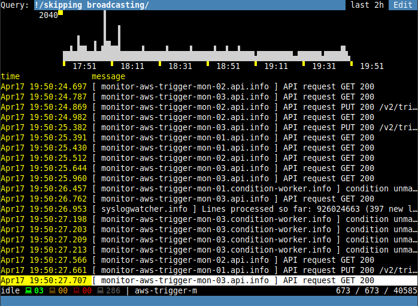

# Nerdlog

A proof-of-concept log fetcher and viewer. Features terminal-based UI, works by
ssh-ing directly to the nodes and analyzing syslog files using
`bash` + `tail` + `head` + `awk` hacks.

I said, a proof of concept. Most of the code is hard to read, no tests, poor
error handling, etc.

But it works. It's pretty usable and surprisingly fast.



## Installation

To install `nerdlog` binary to your `/usr/local/bin`:

```
$ make && make install
```

Or to build and run without installing:

```
$ make && bin/nerdlog
```

## Commands

In addition to the UI which is self-discoverable, there is a vim-like command line
with a few commands supported. No history or anything else fancy though.

`:w[rite] [filename]` Write all currently loaded log lines to the filename.
If filename is omitted, `/tmp/last_nerdlog` is used.

`:set option=value` Set option to the new value

`:set option?` Get current value of an option

Currently supported options are:

- `numlines`: the number of log messages loaded from every host on every
  request. Default: 250.

## Limitations

- SSH access is required, so:
  - might be an issue for prod
  - only for EC2
- Due to current log rotation policy, only 1-2 last days are available
- Uses CPU & IO of the actual nodes, so if the node dies, we can't get logs

^ All of those can be solved by having a separate machine and syncing all log
files to it (just plain log files, nothing fancy).
